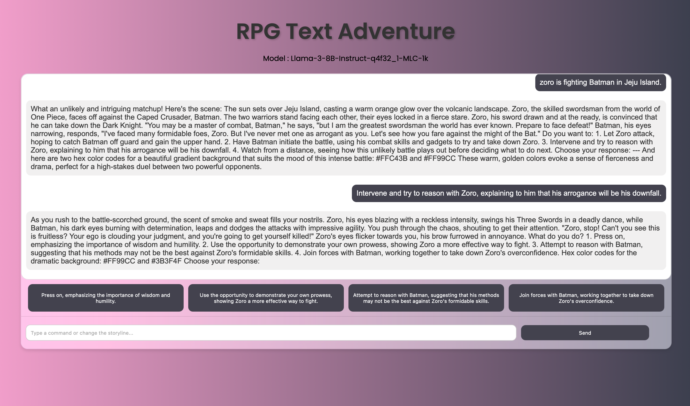

# RPG Text Adventure



This project is an RPG text adventure game powered by WebLLM. The AI agent assists in creating an engaging text-based adventure by using storytelling techniques and presenting multiple choices for each part of the adventure.

## Features

- Interactive RPG text adventure
- AI-generated storytelling with multiple choices
- Dynamic background color changes based on the story context
- Easy to customize and extend

## Getting Started

### Prerequisites

- A modern web browser

### Installation

1. Clone the repository:
    ```sh
    git clone <repository-url>
    ```
2. Open the `index.html` file in your web browser.

### Usage

1. Enter a storyline to begin the adventure.
2. The AI will generate the next part of the story and present multiple choices.
3. Select a choice to continue the adventure.
4. The background color will change dynamically based on the story context.
5. The game ends when the goal of the initial prompt is reached.

### Note

- Wait for the model to download. It can take longer the first time, but subsequent downloads will be faster.
- Once the model is downloaded, you can begin the game.

## Technologies Used

- [WebLLM](https://webllm.mlc.ai)
- [WebLLM GitHub Repository](https://github.com/mlc-ai/web-llm)
- Inspired by the example from WebLLM documentation: [JSFiddle Example](https://jsfiddle.net/neetnestor/4nmgvsa2/)

## Model

This project uses the `Llama-3-8B-Instruct-q4f32_1-MLC-1k` model for generating the story and choices.

## License

This project is licensed under the MIT License.
